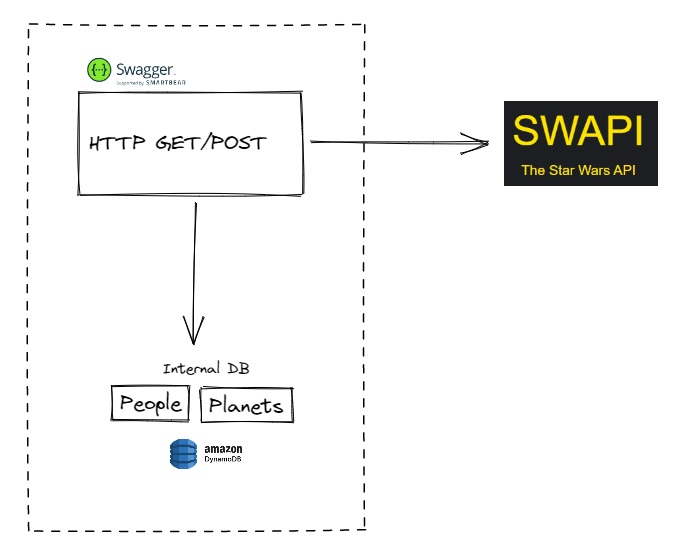
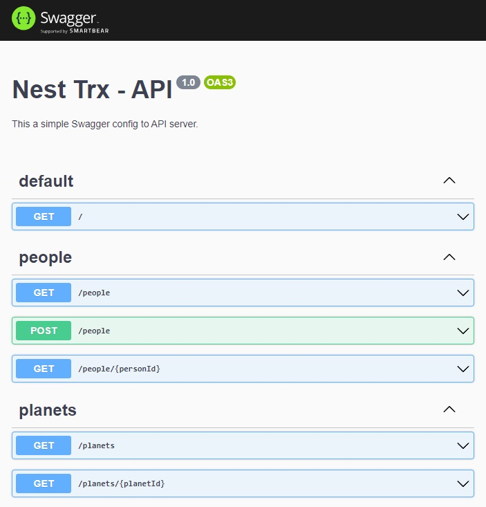

<p align="center">
  <a href="http://nestjs.com/" target="blank"></a>
</p>

<p align="center">A progressive <a href="http://nodejs.org" target="_blank">Node.js</a> framework for building efficient and scalable server-side applications.</p>

## Description

[Nest](https://github.com/nestjs/nest) server to consume Swapi API and Internal DB.

1. Write an **HTTP GET** method to retrieve all information from the **planets** and **people** databases from [SWAPI](https://swapi.dev/) with a **limit** param. For example, if parameter A is 5, you will get only 5 elements of the total. Consider not using the internal database, but get the data directly from SWAPI.
2. Write an **HTTP GET** method to retrieve information from the **planets** databases from [SWAPI](https://swapi.dev/) and save information in a internal database.
3. Write an **HTTP GET** method to retrieve information from **people** databases from [SWAPI](https://swapi.dev/) and save information in a internal database.
4. Write an **HTTP POST** method to save any information about **people** in your database.  

Below are the endpoints that you will implement:

| INFO | METHOD | URL |
| --- | --- | --- |
| GET PLANETS WITH LIMIT | GET | :baseURL/api/planets?limit=:limit |
| GET PEOPLE WITH LIMIT | GET | :baseURL/api/people?limit=:limit |
| GET ANY PLANET BY ID | GET | :baseURL/api/planets/:planetId |
| GET ANY PERSON BY ID | GET | :baseURL/api/people/:personId |
| POST ANY PERSON | POST | :baseURL/api/people |

### Diagram: 



## Installation

```bash
$ npm install
```

## Running the app

```bash
# development
$ npm run start

# watch mode
$ npm run start:dev

# production mode
$ npm run start:prod
```

## Testing API
Run `npm run start` for a dev server. Navigate to `http://localhost:3000/`. The application will show Swagger API docs.



## Stay in touch

- Author - Axel Leguía Chero
- Linkedin - [https://www.linkedin.com/in/axel-leguia-chero/](https://www.linkedin.com/in/axel-leguia-chero/)
